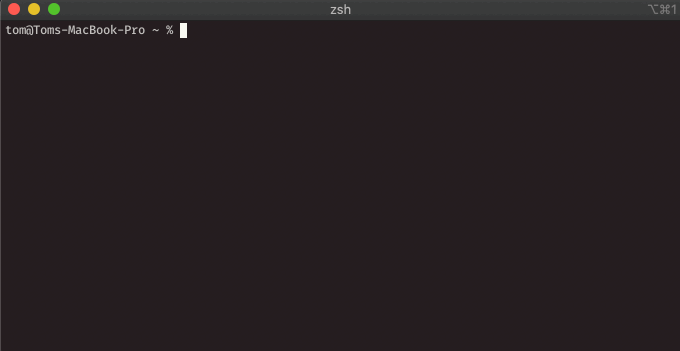

# Overview
tfex-rs is a simple \[t\]erminal \[f\]ile \[ex\]plorer written in Rust. It's not very useful in it's current state, and probably never will be. It was written for fun/practice rather than to be actually used.

# Controls
| Key | Command |
| --- | ------- |
| j | Move selection down |
| k | Move selection up |
| : | Enter command mode |
| Esc | Exit command mode |
| Enter | Open folder or execute command |
| Backspace | Move up one directory |

# Working Commands
So far only `rename [new file name]` and `delete` exist, but I am actively working on new commands (for now).

# Installation
tfx-rs should definitely work on macOS. It'll *probably* work on Linux, and almost definitely won't work on Windows. 
* Install rustup (https://rustup.rs)
* Clone this repository (`git clone https://github.com/PorkSausages/tfex-rs.git`)
* Run `cargo install --path /path/to/cloned/repository/`
* Launch by running `tfex`

# Known issues
* Fairly often not all of the files/directories in your current directory will be shown. You have to resize the window randomly until the missing entries show up. One day I'll look into why this happens, or maybe you could fix it for me!